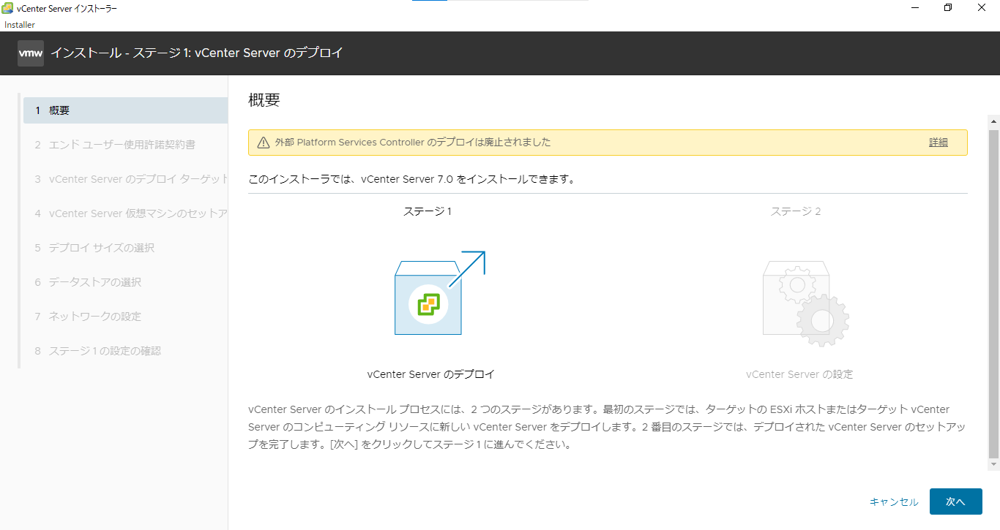
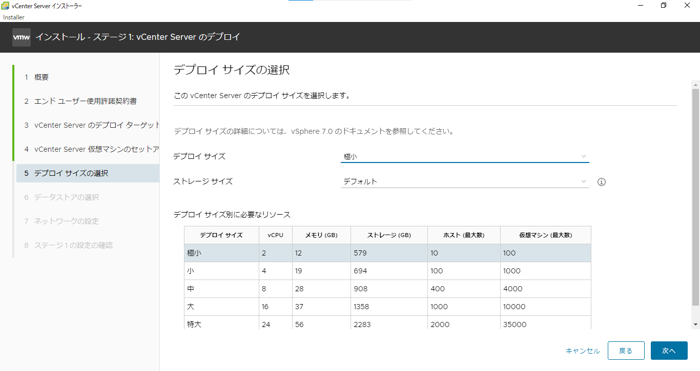
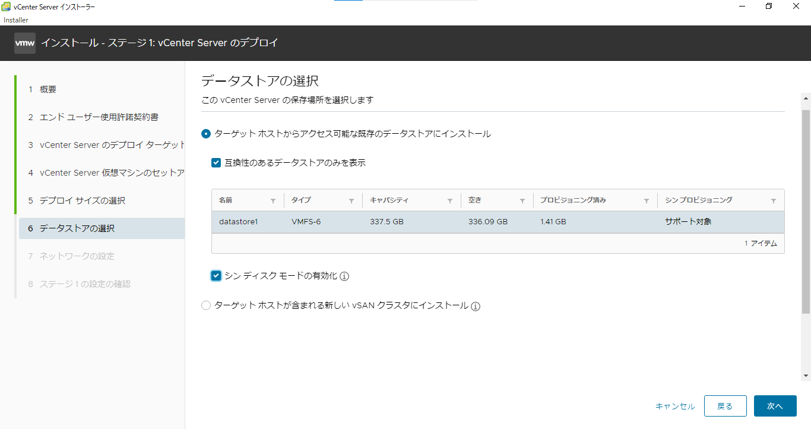
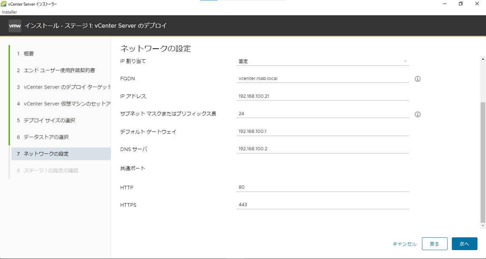
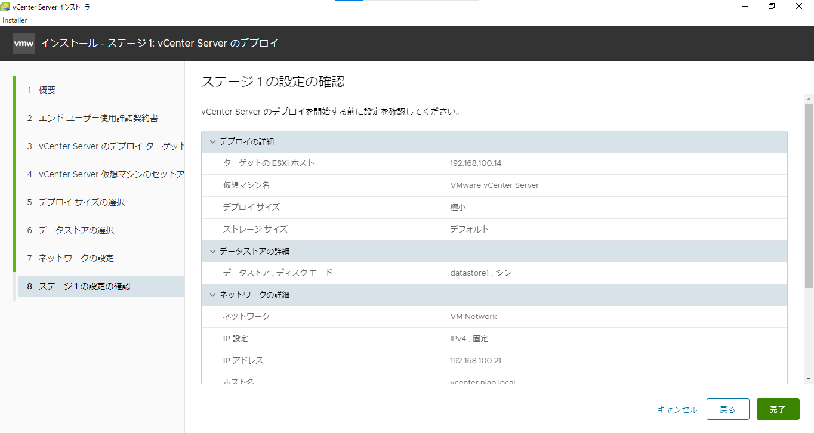
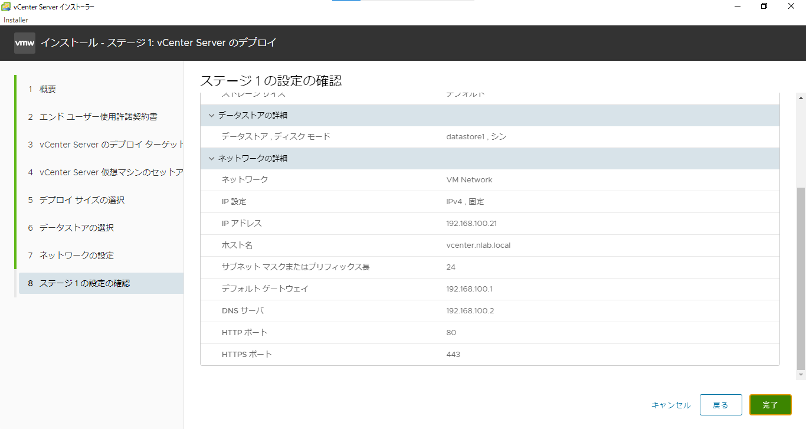
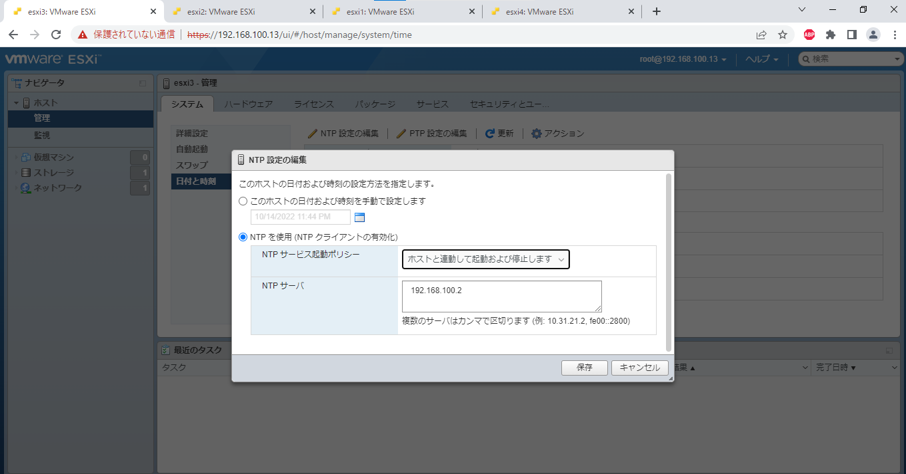
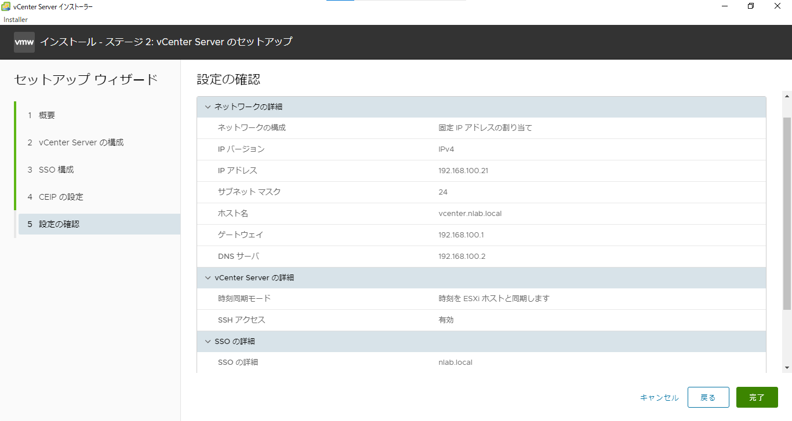

# vCenter Server
## 概要
- 実験日: 2022/09/23,2022/09/30
- vCenter Server

目次
- [vCenter Server](#vcenter-server)
  - [概要](#概要)
  - [1. 今回の実験](#1-今回の実験)
  - [2. vCenter Serverについて](#2-vcenter-serverについて)
    - [2.1 vCenter Serverとは](#21-vcenter-serverとは)
    - [2.2 vCenter Serverの機能](#22-vcenter-serverの機能)
  - [3. vCenter Serverのダウンロード手順](#3-vcenter-serverのダウンロード手順)
  - [4. まとめ](#4-まとめ)

## 1. 今回の実験

&nbsp;今回の実験では､研究室の環境([詳細はこちら](./00-VM-Machines.md))を利用して､vCenter Serverの構築を目指した｡ 

&nbsp;目的として､vCenter Serverのインストール方法や設定方法の理解になれることである｡
## 2. vCenter Serverについて

### 2.1 vCenter Serverとは
- vCenter Serverとは､複数のEsxiを束ねて1つの管理画面にて操作することを可能にする統合管理プラットフォーム

### 2.2 vCenter Serverの機能
- 1つのvCenter Serverで､最大で2500のホスト数及び45000台の仮想マシン(ver7.0)
- vSphereをインストールすることで､GUIベースにて操作可能

## 3. vCenter Serverのダウンロード手順

1. vCenterをVMwareからダウンロードする｡

2. ダウンロードフォルダなどに保存したISOイメージをマウントする｡

3. マウントされた中の`VMware VCSA/vcsa-ui-installer/win32/install.exe`ファイルを実行する｡

*図1 stage1の概要*

4. vCenter Serverのデプロイターゲット欄には､ダウンロード先には､[esxi2のホスト](./00-VM-Network-Overview.md)､Esxiホスト名= `192.168.100.21`､ユーザ名=`root`､パスワード=`P@ssw0rd`を入力する｡(esxi2にインストールした際に設定したユーザ名とパスワードを利用してください)

5. vCenter Serverの仮想マシンのセットアップ欄では､仮想マシン名 = `vCenter Server`､rootパスワード=`P@ssw0rd` を入力する｡

6. 自分の環境に適したサイズを選択する。今回の場合は、実験用のため最小を選択する。

*図2 デプロイサイズの選択*

7. vCenterを入れるデータストアを選択する。この際に､`シンディスクモードの有効化`をする必要がある｡(有効化しないと､シックプロビジョニングが選択されるため､仮想ディスク作成時に指定したサイズ分の領域を確保する｡その際に､指定したサイズが大きいため有効化しなければならない｡)

*図3 データストアの選択*

8. vCenter自身のFQDN = `vcenter.nlab.local`､vCenterのipアドレス=`192.168.100.21`、サブネットマスク=`255.255.255.0`、デフォルトゲート=`192.168.100.1`、DNSサーバー=`192.168.100.2`を入力した｡([詳細はこちら](./00-VM-Network-Overview.md))

*図4 ネットワークの設定*

9. ステージ１のインストールが終了するとステージ２の設定をする

*図5 ステージ1の設定(前半)*

*図6 ステージ1の設定(後半)*

10. ステージ2のvCenter Serverの構成にて､時刻同期モード = `NTPサーバーと時間を同期する`を選択し､NTPサーバー = `192.168.100.2` を設定する｡その際､各Esxi1~4に`192.168.100.1x`にてログインし､管理､システム､日付と時刻に進みNTPサーバー場所を指定する必要がある｡

*図7 各EsxiにおけるNTPの設定*

11. SSO構成欄には､Single-Sign-Onドメイン名=`nlab.local`､Single-Sign-Onパスワード=`P@ssw0rd`を入力する｡また､SSHアクセスを有効にする｡

*図8 ステージ2の設定*

12. ステージ2のインストールが完了するとログインする｡

13. 192.168.100.21を検索し､`11`にて設定したユーザー名 = administrator+@+ドメイン名 = `administrator@nlab.local`､パスワード=`P@ssw0rd`を入力しログインを行う｡

以上の手順を踏むことによって､vCenter Serverを導入することが出来る｡

## 4. まとめ
- VMware会社が提供している統合管理プラットフォーム
- 1つのvCenter Serverで､最大で2500のホスト数及び45000台の仮想マシン(ver7.0)
- vSphereをインストールすることで､GUIベースにて操作可能